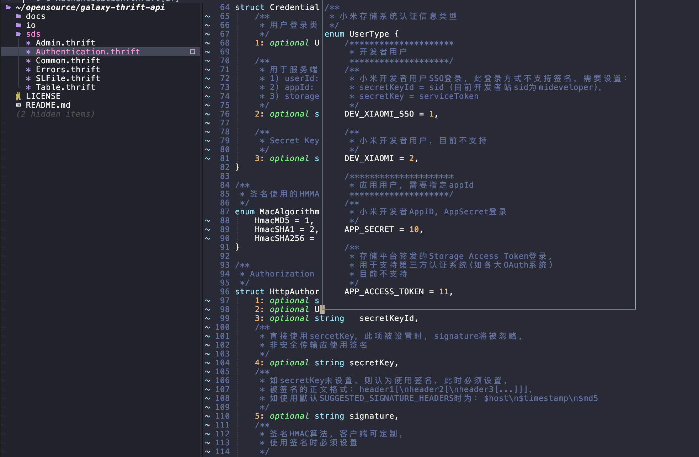
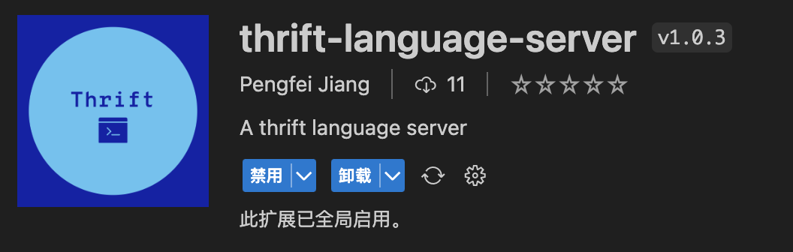

# Thrift language server

[](https://raw.githack.com/wiki/joyme123/thrift-ls/coverage.html)


thrift-ls implements language server protocol

## features

- highlight
- code completion
- go to definition
- find references
- hover
- dignostic
- rename
- format
- document symbols

## As Thrift Langugae Server

### vim

use thriftls as a lsp provider for thrift

### neovim

You can use [mason](https://github.com/williamboman/mason.nvim) to install thriftls.
And use [nvim-lspconfig](https://github.com/neovim/nvim-lspconfig) to configure thriftls

`:LspInfo` to set lsp information. default log file location: `~/.local/state/nvim/lsp.log`.



### vscode

install thrift-language-server from extension market



## As Thrift Format Tool

**supported flags**

```plaintext
Usage of ./bin/thriftls:
  -align string
        Align enables align option for struct/enum/exception/union fields, Options: "field", "assign", "disable", Default is "field" if not set. (default "field")
  -d	Do not print reformatted sources to standard output. If a file's formatting is different than gofmt's, print diffs to standard output.
  -f string
    	file path to format
  -format
    	use thrift-ls as a format tool
  -indent string
    	Indent to use. Support: num*space, num*tab. example: 4spaces, 1tab, tab (default "4spaces")
  -logLevel int
    	set log level (default -1)
  -w	Do not print reformatted sources to standard output. If a file's formatting is different from thriftls's, overwrite it with thrfitls's version.
```

**how to use**

```bash
# format single file
thriftls -format -w -indent 2spaces -f ./tests/galaxy-thrift-api/sds/Table.thrift

# batch format thrift files
find ./tests/galaxy-thrift-api -name "*.thrift" | xargs -n 1 thriftls -format -w -indent 8spaces -f
```

## Configurations

config file default location:

- windows: `C:\Users\${user}\.thriftls\config.yaml`
- macos, linux: `~/.thriftls/config.yaml`

## TODO

[] optimize code completion
